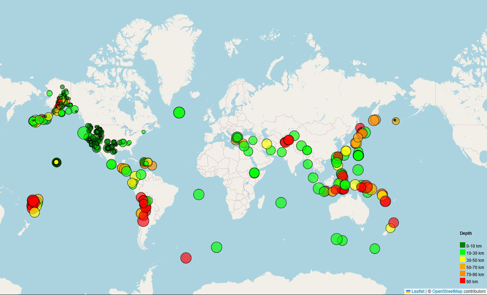

# Leaflet-Challenge

## Website: 
[website](git@github.com:Rock-Roll1968/Leaflet-Challenge.git)

## Description
Leaflet Earthquake Visualization

## Table of Contents
- [Installation](#installation)
- [Usage](#usage)
- [Credits](#credits)

- [Features](#features)

- [Contact](#contact)

## Installation
VS Code, Python, D3, GeoJSON, Leaflet URL, HTML, CSS

## Usage
Launch HTML with VS Code Live Server extension

## Credits
Ernesto Garcia

## Features
Interactive map with hover and click markers with details for tremor locations, magnitude and depth. 

## Contact
If there are any questions or concerns, I can be reached at:
##### [github: ROCK-ROLL1968](https://github.com/ROCK-ROLL1968)
##### [email: ernesto.v.garcia@outlook.com](mailto:ernesto.v.garcia@outlook.com)
